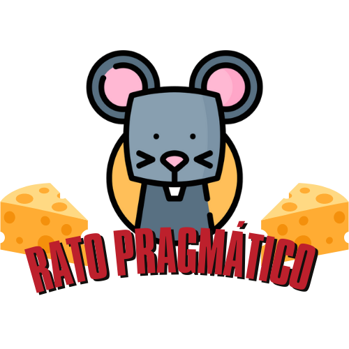

<div align=center> 

</div>

**Número da Lista**: 12 <br>
**Conteúdo da Disciplina**: Grafos 2<br>

## Alunos
|Matrícula | Aluno |
| -- | -- |
| 18/0119231  |  Eduardo Maia Rezende |
| 17/0107426  |  Kayro César Silva Machado |

## Sobre 

<p>O projeto consiste em um jogo onde o usuário deve posicionar o queijo e os gatos em um tabuleiro e o Rato Pragmático deve encontrar o menor caminho, sem passar pelos gatos posicionados até o queijo, de forma que seja possível ao usuário vizualizar os passos que o rato segue para farejar seu queijo. O jogo foi desenvolvido utilizando a biblioteca pygame e o algoritmo de Dijkstra para encontrar o menor caminho.</p><br>


## Screenshots
<div align=center>


<br>
</div>

## Video de Apresentação
[ Video de Apresentação](https://youtu.be/F4OwdFRNuLY)

## Instalação 

**Linguagem**: Python<br>

- Dependências:
    - pygame
    - Pillow
    - tkinter

### Passo 1:
 Caso não possua as dependências descritas acima, instale-as na pasta raiz do projeto utilizando comando abaixo:
```sh
pip install -r requirements.txt
```
### Passo 2:
Entre na pasta **src** do projeto e execute o arquivo principal  com o comando abaixo:
```
python3 app.py
```

## Uso

Ao iniciar a execução da aplicação deve-se utilizar o botão direito do mouse para posicionar o queijo e o botão esuerdo para posicionar os gatos. Após isso utilize a barra de espaço para que o nosso Rato Pragmático comece a farejar e encontre o menor caminho para o queijo.

